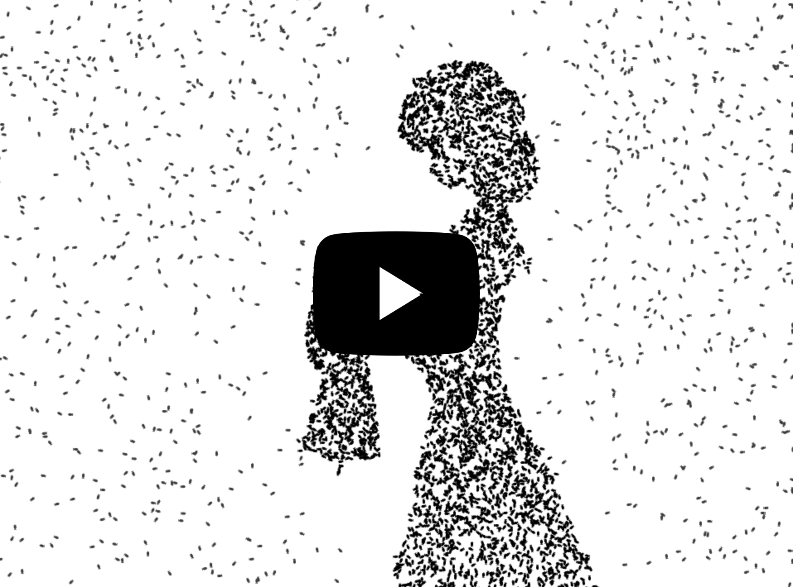

# Bad Apple!! But its 5.000 fishes


Made with HTML Canvas + React.

## Final vidéo

[](https://www.youtube.com/watch?v=bKs2jukK-ME&ab_channel=St%C3%A9phaneWouters)

## Live simulation

Use the following link to see the live simulation :
https://badapple.doelia.fr/

You can tweak the parameters to see how the simulation behaves with different settings.

## Developement

Requirements :
- Node.js
- NPM
 
Run the project locally :
```
npm install
npm run dev
```

Recording conditions:
- Safari (for the best performance)
- [Black Hole](https://existential.audio/blackhole/) to record audio out
- Quicktime screen record
